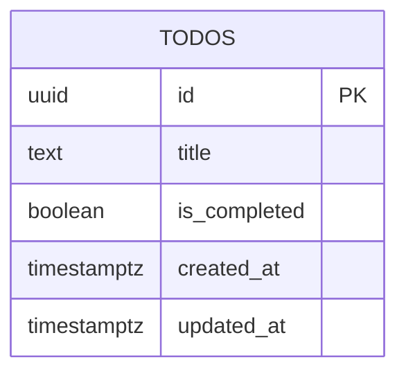

# Database Design (ERD) — Todo List App v2

Engine: PostgreSQL 16
Last updated: 2026-08-11
Source requirements: `docs/todos/SRS.md`

## 1. Overview

This schema stores the deployment-level todo list for Todo List App v2. The only aggregate root is `todos`: each row represents one task with its title, completion state, and timestamps needed for stable ordering and last-saved state. Login, user identity, private lists, due dates, priorities, labels, comments, reminders, recurrence, search metadata, and undo/restore history are deliberately kept out of the database because the SRS excludes them.

## 2. Diagram

Cardinality notation: `||` exactly one, `o|` zero or one, `}o` zero or many, `}|` one or many. There are no inter-table relationships in this schema because the app has no login, accounts, lists, or child entities.

## 3. Entities

### 3.1 `todos`

**Purpose** — Stores each saved todo task shown in the shared deployment-level list. **Traces to** — TODOS-001, TODOS-002, TODOS-003, TODOS-004, TODOS-005, TODOS-006.

| Column | Type | Null | Default | Unique | Description |
|---|---|---|---|---|---|
| `id` | `uuid` | no | `gen_random_uuid()` | PK | Stable surrogate identifier for create response, status changes, and deletion. |
| `title` | `text` | no | none | no | Trimmed todo label displayed to users; duplicate titles are allowed. |
| `is_completed` | `boolean` | no | `false` | no | Completion status; `false` means active and `true` means completed. |
| `created_at` | `timestamptz` | no | `now()` | no | Creation time used for stable oldest-first ordering across refreshes. |
| `updated_at` | `timestamptz` | no | `now()` | no | Last successful status/title row update time; used as the latest saved state marker if needed. |

**Nullable columns** — none.

**Foreign keys** — none. The SRS explicitly excludes login, accounts, private lists, labels, comments, and other parent/child entities.

**Constraints**

| Name | Definition | Rule enforced |
|---|---|---|
| `ck_todos_title_trimmed_not_blank` | `CHECK (length(btrim(title)) BETWEEN 1 AND 200)` | Todo titles must be non-blank after trimming and must not exceed the 200 character limit from TODOS-002 and TODOS-006. |
| `ck_todos_title_is_trimmed` | `CHECK (title = btrim(title))` | Stored titles are already trimmed so readers do not need to trim every display value. |

**Indexes**

| Name | Columns | Type | Query it serves |
|---|---|---|---|
| `idx_todos_created_at_id` | `created_at`, `id` | btree | List all current todos in stable oldest-first order for TODOS-005; `id` is a deterministic tie-breaker when multiple rows share the same timestamp. |

**Lifecycle** — hard delete. TODOS-004 and TODOS-005 require deleted todos to be absent after refresh, and the SRS excludes undo/restore and audit history. A deleted todo has no child rows and no reporting requirement, so physical deletion keeps reads simple and avoids `deleted_at IS NULL` filters on every list query.

## 4. Enumerations

No enumerations are needed. Completion status is a boolean because the SRS defines exactly two states: active and completed.

| Name | Values | Mechanism | Why |
|---|---|---|---|
| n/a | n/a | n/a | No fixed multi-value domain exists in the approved requirements. |

## 5. Access patterns

| # | Pattern | Frequency | Index used |
|---|---|---|---|
| 1 | Load all todos ordered by `created_at ASC, id ASC` when the page opens, refreshes, or retries after load failure. | High: every page load/refresh/retry. | `idx_todos_created_at_id` |
| 2 | Insert one todo with trimmed title, `is_completed = false`, and generated timestamps. | Medium: each add action. | Primary key only; no secondary index is needed for insert. |
| 3 | Update one todo's `is_completed` and `updated_at` by `id`. | Medium: each complete/uncomplete action. | Primary key index on `id`. |
| 4 | Delete one todo by `id`. | Medium: each delete action. | Primary key index on `id`. |

## 6. Data volume and growth

| Table | Rows at launch | Growth | Retention |
|---|---|---|---|
| `todos` | 0 | Expected to remain small; SRS boundary explicitly verifies 100 visible todos, with no requirement suggesting high-volume ingestion. | Rows are retained until the user deletes them; deletion is hard delete. |

No table is expected to exceed 10M rows within a year for this simple shared-list app. No partitioning or archival strategy is needed for the approved scope.

## 7. Integrity, privacy, and security

- Database-enforced invariants: every todo has a surrogate UUID primary key, a non-null trimmed title of 1 to 200 characters, a non-null boolean completion state, and non-null creation/update timestamps.
- Application-enforced invariants: request bodies are validated at the HTTP boundary before writes so users receive clear non-technical validation errors instead of raw database constraint errors; the database constraints remain the final protection against invalid rows.
- Personal data: only todo titles and completion state are stored. Todo titles may contain user-entered personal content, but the app stores no login identity, profile, email, IP-derived user table, or account identifier.
- Secrets: no table stores secrets, credentials, tokens, password hashes, or private keys.
- Row-level access: none. The SRS defines one shared deployment-level list accessible to any visitor without login.
- Concurrency: last successful write wins for status changes and deletes, matching TODOS-003 and TODOS-006. Updating or deleting a missing `id` returns a not-found application response and does not require extra schema state.

## 8. Migrations

| # | Change | Forward | Backward | Safe on non-empty table |
|---|---|---|---|---|
| 1 | Enable UUID generation | `CREATE EXTENSION IF NOT EXISTS pgcrypto;` | `DROP EXTENSION IF EXISTS pgcrypto;` only if no remaining database object depends on it | Safe. Idempotent extension creation is safe before application tables exist. The down migration may be skipped or guarded in shared databases if other objects use `pgcrypto`. |
| 2 | Initial `todos` table | Create `todos` with `id uuid PRIMARY KEY DEFAULT gen_random_uuid()`, `title text NOT NULL`, `is_completed boolean NOT NULL DEFAULT false`, `created_at timestamptz NOT NULL DEFAULT now()`, `updated_at timestamptz NOT NULL DEFAULT now()`, and the two title check constraints. | `DROP TABLE IF EXISTS todos;` | Safe for an empty database. On a populated table, the backward migration is destructive because it deletes todo data; only run after backup or in disposable environments. |
| 3 | Stable list-order index | `CREATE INDEX idx_todos_created_at_id ON todos (created_at, id);` | `DROP INDEX IF EXISTS idx_todos_created_at_id;` | Safe on an empty table. On a populated table, prefer `CREATE INDEX CONCURRENTLY` outside a transaction to avoid blocking writes. |

Initial migration filenames should follow the architecture convention, for example `20260811000100_create_todos.up.sql` and `20260811000100_create_todos.down.sql`. This task records the schema design only; Dev will implement migrations in the backend story.

## 9. Open questions

| Question | Owner | Blocking |
|---|---|---|
| none | n/a | no |

## 10. Story extension — Database-backed todo persistence

No new entity is required beyond the existing `todos` table for this story. The reviewed UI mock module uses frontend DTO fields `id`, `title`, `completed`, `createdAt`, and `updatedAt`; these map directly to existing database columns.

| Frontend/API field | Database source | Conversion |
|---|---|---|
| `id` | `todos.id` | UUID rendered as string. |
| `title` | `todos.title` | Stored trimmed text. |
| `completed` | `todos.is_completed` | Boolean renamed at the HTTP boundary to match the approved UI mock. |
| `createdAt` | `todos.created_at` | RFC 3339 UTC string rendered in camelCase. |
| `updatedAt` | `todos.updated_at` | RFC 3339 UTC string rendered in camelCase. |

The mock uses sample ids such as `todo_20260811_001`; production ids remain UUID strings because the merged ERD already defines `todos.id uuid PRIMARY KEY` and backend operations need database-generated stable identifiers. This is the only intentional difference from the sample mock values; the field name and string type stay the same.

### Migration plan for this story

| Step | Forward migration | Backward migration | Safe on populated table |
|---|---|---|---|
| 1 | Apply the already-defined initial migration: enable `pgcrypto`, create `todos`, add title constraints, and create `idx_todos_created_at_id`. | Drop `idx_todos_created_at_id`, then drop `todos`; drop `pgcrypto` only if no other object depends on it. | Forward is safe on an empty database and safe on a populated database only if the table does not already exist. Backward is destructive on populated data and must be limited to disposable environments or run after backup. |
| 2 | No additional schema changes for the Database-backed todo persistence story. | No additional rollback. | Safe; this story only binds API contracts to the existing table. |

No foreign keys or `ON DELETE` actions are introduced because the app has no parent/child entities. Hard delete remains the lifecycle for `todos` rows.
