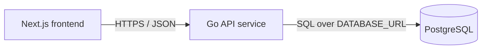

# Service & Interface Design — Todo List App v2

Last updated: 2026-08-11
Source: `docs/todos/SRS.md`, `docs/architecture/erd.md`, `docs/architecture/overview.md`, `docs/todos/stories/single-page-todo-experience.md`, reviewed UI mock module from PR #13 (`code/frontend/lib/mock/single-page-todo-experience.ts`)

## 1. Service map



| Service | Responsibility | Owns (tables) | Depends on | Deploy unit |
|---|---|---|---|---|
| Next.js frontend | Renders the single-page todo UI, validates obvious client-side form rules for immediate feedback, and calls the API for durable state. | none | Go API service via `NEXT_PUBLIC_API_URL` | frontend container |
| Go API service | Owns todo persistence, validates all external API input, applies migrations, exposes health and todo JSON endpoints. | `todos` | PostgreSQL via `DATABASE_URL` | backend container |
| PostgreSQL | Durable storage for the deployment-level shared todo list. | n/a | none | database service |

**Entity ownership**

| ERD entity | Owning service | Write access | Read access |
|---|---|---|---|
| `todos` | Go API service | Go API service only through parameterized SQL | Frontend reads only through Go API endpoints; no direct database access |

## 2. Cross-cutting contract

### 2.1 Base

- Base URL: `{scheme}://{host}/api/v1`
- Content type: `application/json; charset=utf-8`
- Versioning: URL path major version. A new major version is used only for breaking changes.
- Trace header: `X-Request-Id` accepted from the caller, generated if absent, echoed on every response and present in every backend log line.
- Response timestamps: RFC 3339 UTC strings.
- IDs: UUID strings on the wire.
- Collection response shape for the todo UI: object with `data` array and `meta` counts, matching the reviewed UI mock module from PR #13.

### 2.2 Authentication and authorization

| Aspect | Decision |
|---|---|
| Mechanism | None. The product has no login; all visitors use the shared deployment-level list. |
| Transport | No `Authorization` header required or interpreted for todo endpoints. |
| Roles | Single anonymous `User` actor. |
| Enforcement point | API route layer permits anonymous access; no per-resource ownership checks exist because there is no identity. |

### 2.3 Error contract

Every non-2xx response from every endpoint has this shape:

```json
{
  "error": {
    "code": "VALIDATION_FAILED",
    "message": "Human-readable summary, safe to show a user.",
    "details": [
      { "field": "title", "code": "TOO_LONG", "message": "Title must be 200 characters or fewer." }
    ],
    "request_id": "01HXEXAMPLE"
  }
}
```

The reviewed mock error had only `error.code` and `error.message` with `SAVE_FAILED`; that is not carried forward because the project-wide service contract has a richer error catalog. The frontend adapter must map retryable API errors to the existing non-technical UI text, "We could not save that change. Please try again.", rather than branching on mock-only `SAVE_FAILED`.

**Error catalog** — the full closed set for this project.

| Code | HTTP | Meaning | Retryable |
|---|---|---|---|
| `BAD_REQUEST` | 400 | Request JSON is malformed, body is too large, unsupported content type, invalid UUID path format, or a field has the wrong JSON type. | no |
| `VALIDATION_FAILED` | 422 | Request is well-formed but violates semantic rules such as blank or overlong title. | no |
| `NOT_FOUND` | 404 | Todo does not exist, including already-deleted todos. | no |
| `RATE_LIMITED` | 429 | Too many requests from the same client source; response includes `Retry-After`. | yes |
| `INTERNAL` | 500 | Unexpected failure; details are logged with `request_id`, not returned. | yes |
| `UNAVAILABLE` | 503 | Database is unavailable, migrations are incomplete, or the service is shutting down. | yes |

### 2.4 Todo DTO contract from the approved UI mock

```ts
type TodoDto = {
  id: string;
  title: string;
  status: "active" | "completed";
  createdAt: string;
  updatedAt: string;
};

type TodoListResponse = {
  data: TodoDto[];
  meta: {
    total: number;
    active: number;
    completed: number;
  };
};
```

The API returns this camelCase DTO shape for todo responses so the approved component can replace the mock module with a real service adapter. The database still uses snake_case and `is_completed`; mapping happens at the Go API boundary.

### 2.5 Validation boundary

The validation boundary is the Go API HTTP handler layer, before any repository/database call. It validates method, content type, body size, JSON syntax, field presence, field type, UUID path format, string trimming, title length, and boolean status values. Downstream service and repository code may trust validated inputs and must not perform defensive re-validation except for database constraint handling as a final integrity guard.

### 2.6 Idempotency

| Endpoint | Accepts `Idempotency-Key` | Retention | Replay behavior |
|---|---|---|---|
| `POST /api/v1/todos` | No for v1. Creating duplicate titles is allowed and retries can intentionally create another todo. | n/a | n/a |
| `PATCH /api/v1/todos/{todo_id}` | No. Last successful write wins; setting `status` to the same value is safe and returns the current todo. | n/a | n/a |
| `DELETE /api/v1/todos/{todo_id}` | No. The HTTP method is idempotent by resource state: deleting an existing todo returns 204; deleting a missing/already-deleted todo returns 404 so the UI can refresh/remove it. | n/a | n/a |

## 3. Endpoints

### 3.1 `GET /api/v1/todos`

**Purpose** — Load persisted non-deleted todos in stable oldest-first order for the single page. **Traces to** — TODOS-001, TODOS-005. **Auth** — anonymous User.

**Path / query parameters** — none for this story. The SRS verifies a 100-todo boundary and the UI mock has no pagination fields, so v1 returns the current deployment-level list in one envelope.

**Request body** — none. If a body is sent with non-zero length, the API ignores it and does not create side effects.

**Success response** — `200`

```json
{
  "data": [
    {
      "id": "01900000-0000-7000-8000-000000000000",
      "title": "Buy milk",
      "status": "active",
      "createdAt": "2026-08-11T10:04:18Z",
      "updatedAt": "2026-08-11T10:04:18Z"
    }
  ],
  "meta": {
    "total": 1,
    "active": 1,
    "completed": 0
  }
}
```

**Errors** — every code this endpoint can return. No others.

| Code | HTTP | Trigger |
|---|---|---|
| `RATE_LIMITED` | 429 | Client source exceeds read rate limit. |
| `INTERNAL` | 500 | Unexpected server error. |
| `UNAVAILABLE` | 503 | Database is unreachable, migrations are not ready, or service is shutting down. |

**Notes** — Stable ordering is guaranteed by `created_at ASC, id ASC`. Empty state is represented by `data: []`, not an error.

### 3.2 `POST /api/v1/todos`

**Purpose** — Create one active todo durably from user-entered text. **Traces to** — TODOS-002, TODOS-006. **Auth** — anonymous User.

**Request body**

```json
{
  "title": "Buy milk"
}
```

| Field | Type | Required | Constraints | Description |
|---|---|---|---|---|
| `title` | string | yes | Trimmed by the API before validation; 1 to 200 characters after trimming; no coercion from other JSON types | Todo label to save. Duplicate titles are allowed. |

**Success response** — `201`; header `Location: /api/v1/todos/{todo_id}`

```json
{
  "id": "01900000-0000-7000-8000-000000000000",
  "title": "Buy milk",
  "status": "active",
  "createdAt": "2026-08-11T10:04:18Z",
  "updatedAt": "2026-08-11T10:04:18Z"
}
```

**Errors** — every code this endpoint can return. No others.

| Code | HTTP | Trigger |
|---|---|---|
| `BAD_REQUEST` | 400 | Malformed JSON, body over payload cap, missing JSON object, wrong field type, or unsupported content type. |
| `VALIDATION_FAILED` | 422 | Trimmed `title` is blank or longer than 200 characters. |
| `RATE_LIMITED` | 429 | Client source exceeds write rate limit. |
| `INTERNAL` | 500 | Unexpected server error. |
| `UNAVAILABLE` | 503 | Database is unreachable, migrations are not ready, or service is shutting down. |

### 3.3 `PATCH /api/v1/todos/{todo_id}`

**Purpose** — Mark one todo complete or incomplete and return the saved state. **Traces to** — TODOS-003, TODOS-006. **Auth** — anonymous User.

**Path parameters**

| Name | In | Type | Required | Constraints | Description |
|---|---|---|---|---|---|
| `todo_id` | path | string UUID | yes | Valid UUID string | Todo to update. |

**Request body**

```json
{
  "status": "completed"
}
```

| Field | Type | Required | Constraints | Description |
|---|---|---|---|---|
| `status` | string enum | yes | Must be exactly `active` or `completed`; no null, boolean, number, or unknown string | New completion status. |

**Success response** — `200`

```json
{
  "id": "01900000-0000-7000-8000-000000000000",
  "title": "Buy milk",
  "status": "completed",
  "createdAt": "2026-08-11T10:04:18Z",
  "updatedAt": "2026-08-11T10:05:30Z"
}
```

**Errors** — every code this endpoint can return. No others.

| Code | HTTP | Trigger |
|---|---|---|
| `BAD_REQUEST` | 400 | Malformed JSON, body over payload cap, missing JSON object, wrong field type, missing `status`, `status: null`, unsupported content type, or invalid `todo_id` UUID format. |
| `VALIDATION_FAILED` | 422 | `status` is a string but not `active` or `completed`. |
| `NOT_FOUND` | 404 | No todo exists with `todo_id`, including a todo deleted by another visitor. |
| `RATE_LIMITED` | 429 | Client source exceeds write rate limit. |
| `INTERNAL` | 500 | Unexpected server error. |
| `UNAVAILABLE` | 503 | Database is unreachable, migrations are not ready, or service is shutting down. |

### 3.4 `DELETE /api/v1/todos/{todo_id}`

**Purpose** — Hard-delete one todo so it no longer appears after refresh. **Traces to** — TODOS-004, TODOS-006. **Auth** — anonymous User.

**Path parameters**

| Name | In | Type | Required | Constraints | Description |
|---|---|---|---|---|---|
| `todo_id` | path | string UUID | yes | Valid UUID string | Todo to delete. |

**Request body** — none. If a body is sent with non-zero length, return `BAD_REQUEST`.

**Success response** — `204`, no response body.

**Errors** — every code this endpoint can return. No others.

| Code | HTTP | Trigger |
|---|---|---|
| `BAD_REQUEST` | 400 | Invalid `todo_id` UUID format or non-empty request body. |
| `NOT_FOUND` | 404 | No todo exists with `todo_id`, including a todo already deleted by another visitor. |
| `RATE_LIMITED` | 429 | Client source exceeds write rate limit. |
| `INTERNAL` | 500 | Unexpected server error. |
| `UNAVAILABLE` | 503 | Database is unreachable, migrations are not ready, or service is shutting down. |

### 3.5 `GET /healthz`

**Purpose** — Runtime health check for container orchestration and local readiness. **Auth** — none.

**Success response** — `200`

```json
{ "status": "ok" }
```

**Errors**

| Code | HTTP | Trigger |
|---|---|---|
| `UNAVAILABLE` | 503 | Database check fails, migrations have not completed, or service is shutting down. |
| `INTERNAL` | 500 | Unexpected health handler failure. |

## 4. Asynchronous work

No jobs, queues, schedules, or events are part of the approved scope.

## 5. External integrations and cross-service calls

| Caller | Callee | Purpose | Mode | Timeout | Retry | On failure |
|---|---|---|---|---|---|---|
| Next.js frontend | Go API service | Load todos | Synchronous HTTPS JSON | 5 seconds | One user-initiated retry through the visible retry control | Show a non-technical error state and keep page controls usable enough to retry. |
| Next.js frontend | Go API service | Create todo | Synchronous HTTPS JSON | 5 seconds | No automatic retry for `POST`; user may explicitly submit again | Show a non-technical save error and preserve the current input text. |
| Next.js frontend | Go API service | Update completion status | Synchronous HTTPS JSON | 5 seconds | No automatic retry; user may explicitly try again | Revert the visible todo to the last saved status and show a non-technical error. |
| Next.js frontend | Go API service | Delete todo | Synchronous HTTPS JSON | 5 seconds | No automatic retry; user may explicitly try again | Keep or restore the todo in the visible list and show a non-technical error. |
| Go API service | PostgreSQL | Query and mutate todos | Synchronous SQL | 3 seconds per query | No automatic retry for writes | Return `UNAVAILABLE` for dependency failure or `INTERNAL` for unexpected errors; log details with `request_id`. |

There are no third-party integrations, callbacks, webhooks, OAuth flows, email providers, payment providers, or external secrets in the approved scope.

## 6. Non-functional targets

| Aspect | Target |
|---|---|
| p95 latency (read) | `GET /api/v1/todos` returns within 500 ms from the backend under 100 todos, excluding cold start and network latency. |
| p95 latency (write) | Create, update, and delete endpoints return within 500 ms from the backend under normal database conditions. |
| Availability | Backend reports healthy only after migrations and database check succeed; unhealthy dependencies return `503 UNAVAILABLE`. |
| Rate limit | Per client source: 120 reads/minute and 60 writes/minute. When exceeded, return `RATE_LIMITED` with `Retry-After`. |
| Payload cap | 16 KiB request body for todo write endpoints. |
| Timeout (inbound) | 10 seconds total request handling timeout; database operations within handlers capped at 3 seconds. |

## 7. Observability

- Log fields present on every request line: `request_id`, timestamp, method, path template, status, duration_ms, response_bytes, client_source_hash, and error code when present.
- Metrics per endpoint: request count, error count by error code/status, p50/p95/p99 duration, and in-flight requests.
- What is never logged: secrets, tokens, raw `DATABASE_URL`, full request bodies, full todo titles, stack traces in user responses, or private deployment credentials.

## 8. Contract evolution

| Change | Additive or breaking | Migration path |
|---|---|---|
| Add a new optional response field to todo objects | Additive | Frontend ignores unknown fields. |
| Add due dates, priorities, labels, or accounts | Breaking for product scope, additive for API only if optional | Requires new SRS approval and ERD extension. |
| Rename `status`, `createdAt`, `updatedAt`, `data`, or `meta` | Breaking | Requires a new API major version or coordinated frontend change. |

## 9. Migration plan for this story

| Step | Forward | Backward | Safe on populated table |
|---|---|---|---|
| 1 | Apply the ERD migration plan: enable `pgcrypto`, create `todos`, and add `idx_todos_created_at_id`. | Drop `idx_todos_created_at_id`, drop `todos`, and drop `pgcrypto` only if no remaining object depends on it. | Safe on empty databases. On populated databases, forward index creation should use `CREATE INDEX CONCURRENTLY`; backward table drop is destructive and must only be run after backup or in disposable environments. |
| 2 | Backend maps `todos.is_completed` to API `status` and computes `meta` counts from the returned collection. | Revert adapter mapping to the prior mock-only frontend state if backend integration is rolled back. | Safe; application-code-only change. |
| 3 | Frontend replaces the mock module with real API calls using the same `TodoDto` and `TodoListResponse` shapes. | Restore the mock adapter module. | Safe; application-code-only change. |

## 10. Resolved design decisions

| Decision | Chosen | Rejected alternative | Reason |
|---|---|---|---|
| Todo response envelope | Use reviewed mock shape `{ data, meta }`. | Use a generic `{ todos, next_cursor, has_more }` envelope for this story. | The approved UI is already built against `{ data, meta }`; the SRS only requires rendering 100 todos, so pagination fields would cause unnecessary UI rework now. |
| Completion field on the wire | Use reviewed mock `status: "active" | "completed"`. | Expose database-shaped `is_completed: boolean`. | The frontend already renders string status. The database remains boolean and the API owns the mapping. |
| Error code for save failures | Use project error catalog (`UNAVAILABLE`, `INTERNAL`, `RATE_LIMITED`, etc.) and frontend maps to non-technical copy. | Add mock-only `SAVE_FAILED` to the API catalog. | A broad `SAVE_FAILED` hides retryability and conflicts with the established error catalog. |
| Todo IDs on the wire | Use UUID strings generated by the backend. | Preserve mock `todo_...` identifiers. | Mock IDs are not durable database identifiers; UUID strings satisfy the frontend `string` type without component rework. |

## 11. Open questions

| Question | Owner | Blocking |
|---|---|---|
| none | n/a | no |
