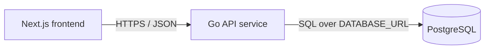

# Service & Interface Design — Todo List App v2

Last updated: 2026-08-11
Source: `docs/todos/SRS.md`, `docs/architecture/erd.md`, `docs/architecture/overview.md`, UI PR #12 mock module `code/frontend/lib/mock/database-backed-todo-persistence.ts`

## 1. Service map



| Service | Responsibility | Owns (tables) | Depends on | Deploy unit |
|---|---|---|---|---|
| Next.js frontend | Renders the single-page todo UI, validates obvious client-side form rules for immediate feedback, and calls the API for durable state. | none | Go API service via `NEXT_PUBLIC_API_URL` | frontend container |
| Go API service | Owns todo persistence, validates all external API input, applies migrations, exposes health and todo JSON endpoints. | `todos` | PostgreSQL via `DATABASE_URL` | backend container |
| PostgreSQL | Durable storage for the deployment-level shared todo list. | n/a | none | database service |

**Entity ownership** — the Go API service is the only writer and reader of `todos`; the frontend reads and mutates todos only through HTTP JSON endpoints.

## 2. Cross-cutting contract

### 2.1 Base

- Base URL: `{scheme}://{host}/api/v1`
- Content type: `application/json; charset=utf-8`
- Trace header: `X-Request-Id` accepted from the caller, generated if absent, echoed on every response and present in backend logs.
- Response timestamps: RFC 3339 UTC strings.
- IDs: UUID strings on the wire.
- Collection response shape: the reviewed UI mock contract: `{ "data": [...], "meta": { ... } }`.

### 2.2 Authentication and authorization

No authentication. The product has no login; all visitors use the same shared deployment-level todo list. No `Authorization` header is required or interpreted for todo endpoints.

### 2.3 Error contract

The reviewed UI mock uses this error envelope, so the backend must return it for todo API errors:

```json
{
  "error": {
    "code": "VALIDATION_FAILED",
    "message": "Title must be 200 characters or fewer."
  }
}
```

`message` must be non-technical and safe to show to a user. Backend logs carry detailed operational context with `request_id`; the response shape intentionally omits implementation details to match the approved mock.

**Error catalog** — the closed set for todo API responses.

| Code | HTTP | Meaning | Retryable |
|---|---|---|---|
| `LOAD_FAILED` | 503 | The list could not be loaded because the database is unavailable, migrations are incomplete, or the service is shutting down. | yes |
| `CREATE_FAILED` | 503 | A valid create request could not be saved because persistence is unavailable. | yes |
| `UPDATE_FAILED` | 503 | A valid completion update could not be saved because persistence is unavailable. | yes |
| `DELETE_FAILED` | 503 | A valid delete request could not be saved because persistence is unavailable. | yes |
| `NOT_FOUND` | 404 | Todo does not exist, including already-deleted todos. | no |
| `VALIDATION_FAILED` | 422 | Request is well-formed but violates semantic rules such as blank title, overlong title, invalid limit, invalid cursor, or invalid UUID. | no |

Malformed JSON, unsupported content type, wrong JSON types, and body size violations also return the same envelope with `code: "VALIDATION_FAILED"` so the frontend has one validation branch matching the mock.

### 2.4 Pagination

The UI mock uses `data` plus `meta.total` and `meta.order`, and the SRS boundary requires 100 todos. The v1 list endpoint therefore returns up to 100 todos in one response with no cursor in this story.

```json
{
  "data": [
    {
      "id": "01900000-0000-7000-8000-000000000000",
      "title": "Buy milk",
      "completed": false,
      "createdAt": "2026-08-11T10:04:18Z",
      "updatedAt": "2026-08-11T10:04:18Z"
    }
  ],
  "meta": {
    "total": 1,
    "order": "created_at_asc"
  }
}
```

| Aspect | Decision |
|---|---|
| Style | No cursor for this story; return all current todos up to the SRS-supported maximum. |
| Max returned | 100. |
| Default sort | `created_at ASC, id ASC`, stable and unique. |

## 3. Endpoints

### 3.1 `GET /api/v1/todos`

**Purpose** — Load persisted non-deleted todos in stable oldest-first order. **Traces to** — TODOS-001, TODOS-005. **Auth** — anonymous User.

**Request** — no path parameters and no request body.

**Success response** — `200`

```json
{
  "data": [
    {
      "id": "01900000-0000-7000-8000-000000000000",
      "title": "Buy milk",
      "completed": false,
      "createdAt": "2026-08-11T10:04:18Z",
      "updatedAt": "2026-08-11T10:04:18Z"
    }
  ],
  "meta": {
    "total": 1,
    "order": "created_at_asc"
  }
}
```

| Field | Type | Nullable | Description |
|---|---|---|---|
| `data` | array of todo objects | no | Current saved todos; empty array means empty state. |
| `data[].id` | string UUID | no | Stable todo identifier. |
| `data[].title` | string | no | Trimmed title. |
| `data[].completed` | boolean | no | Saved completion status. |
| `data[].createdAt` | string timestamp | no | Creation time, RFC 3339 UTC. |
| `data[].updatedAt` | string timestamp | no | Last update time, RFC 3339 UTC. |
| `meta.total` | integer | no | Number of returned todos. |
| `meta.order` | string enum | no | Always `created_at_asc`. |

**Errors**

| Code | HTTP | Trigger |
|---|---|---|
| `LOAD_FAILED` | 503 | Database is unreachable, migrations are not ready, service is shutting down, or an unexpected read error occurs. |

### 3.2 `POST /api/v1/todos`

**Purpose** — Create one active todo durably from user-entered text. **Traces to** — TODOS-002, TODOS-006. **Auth** — anonymous User.

**Request body**

```json
{
  "title": "Buy milk"
}
```

| Field | Type | Required | Constraints |
|---|---|---|---|
| `title` | string | yes | Trimmed before validation; 1 to 200 characters after trimming; duplicate titles allowed. |

**Success response** — `201`

```json
{
  "data": {
    "id": "01900000-0000-7000-8000-000000000000",
    "title": "Buy milk",
    "completed": false,
    "createdAt": "2026-08-11T10:04:18Z",
    "updatedAt": "2026-08-11T10:04:18Z"
  }
}
```

**Errors**

| Code | HTTP | Trigger |
|---|---|---|
| `VALIDATION_FAILED` | 422 | Malformed JSON, non-object body, unsupported content type, wrong `title` type, blank trimmed title, title over 200 characters, or body over 16 KiB. |
| `CREATE_FAILED` | 503 | Database is unreachable, migrations are not ready, service is shutting down, or an unexpected create error occurs. |

### 3.3 `PATCH /api/v1/todos/{todo_id}`

**Purpose** — Mark one todo complete or incomplete and return the saved state. **Traces to** — TODOS-003, TODOS-006. **Auth** — anonymous User.

**Path parameters**

| Name | Type | Required | Constraints |
|---|---|---|---|
| `todo_id` | string UUID | yes | Valid UUID string. |

**Request body**

```json
{
  "completed": true
}
```

| Field | Type | Required | Constraints |
|---|---|---|---|
| `completed` | boolean | yes | JSON boolean only; null, string, number, and absent field are invalid. |

**Success response** — `200`

```json
{
  "data": {
    "id": "01900000-0000-7000-8000-000000000000",
    "title": "Buy milk",
    "completed": true,
    "createdAt": "2026-08-11T10:04:18Z",
    "updatedAt": "2026-08-11T10:05:30Z"
  }
}
```

**Errors**

| Code | HTTP | Trigger |
|---|---|---|
| `VALIDATION_FAILED` | 422 | Invalid UUID, malformed JSON, non-object body, unsupported content type, missing or non-boolean `completed`, or body over 16 KiB. |
| `NOT_FOUND` | 404 | No todo exists with `todo_id`, including already-deleted todos. |
| `UPDATE_FAILED` | 503 | Database is unreachable, migrations are not ready, service is shutting down, or an unexpected update error occurs. |

### 3.4 `DELETE /api/v1/todos/{todo_id}`

**Purpose** — Hard-delete one todo so it no longer appears after refresh. **Traces to** — TODOS-004, TODOS-006. **Auth** — anonymous User.

**Path parameters**

| Name | Type | Required | Constraints |
|---|---|---|---|
| `todo_id` | string UUID | yes | Valid UUID string. |

**Success response** — `200`

```json
{
  "data": {
    "id": "01900000-0000-7000-8000-000000000000",
    "deleted": true
  }
}
```

The response intentionally matches the reviewed mock `TodoDeleteResponse`; v1 does not use `204` for delete.

**Errors**

| Code | HTTP | Trigger |
|---|---|---|
| `VALIDATION_FAILED` | 422 | Invalid UUID or non-empty request body. |
| `NOT_FOUND` | 404 | No todo exists with `todo_id`, including already-deleted todos. |
| `DELETE_FAILED` | 503 | Database is unreachable, migrations are not ready, service is shutting down, or an unexpected delete error occurs. |

### 3.5 `GET /healthz`

**Purpose** — Runtime health check. **Auth** — none.

Success response `200`: `{ "status": "ok" }`. Returns `503` with the standard error envelope when the database check or migrations are not ready.

## 4. External calls and failure behavior

| Caller | Callee | Purpose | Timeout | On failure |
|---|---|---|---|---|
| Next.js frontend | Go API service | Load todos | 5 seconds | Show non-technical load error with retry. |
| Next.js frontend | Go API service | Create todo | 5 seconds | Show non-technical save error and preserve input. |
| Next.js frontend | Go API service | Update completion status | 5 seconds | Revert to last saved status and show non-technical error. |
| Next.js frontend | Go API service | Delete todo | 5 seconds | Keep or restore todo and show non-technical error. |
| Go API service | PostgreSQL | Query and mutate todos | 3 seconds per query | Return the endpoint-specific failure code; log details with request id. |

## 5. Non-functional targets

| Aspect | Target |
|---|---|
| p95 latency read/write | Backend returns within 500 ms under 100 todos, excluding cold start and network latency. |
| Payload cap | 16 KiB for write endpoints. |
| Rate limit | Per client source: 120 reads/minute and 60 writes/minute. Exceeded limits return the endpoint's non-technical error code with HTTP 503 for this story contract. |
| Observability | Log request id, method, path template, status, duration, response bytes, client source hash, and error code; never log secrets, raw `DATABASE_URL`, full request bodies, or full todo titles. |

## 6. Story extension — Database-backed todo persistence

The UI PR #12 mock module is the contract for this story. The backend response field names use camelCase and `data` envelopes to match `TodoDto`, `TodoListResponse`, `TodoMutationResponse`, `TodoDeleteResponse`, and `TodoApiError`.

Intentional differences from earlier draft service conventions:

| Difference | Decision | Reason |
|---|---|---|
| Todo completion field | Use `completed` on the wire, mapped from `todos.is_completed`. | Matches the reviewed UI mock and avoids rework in approved components. |
| Timestamp fields | Use `createdAt` and `updatedAt` on the wire. | Matches the reviewed UI mock; database columns remain snake_case. |
| List envelope | Use `{ data, meta: { total, order } }`. | Matches the reviewed mock and 100-item SRS boundary. |
| Delete success | Return `200` with `{ data: { id, deleted: true } }`. | Matches reviewed mock instead of forcing frontend special-case handling for `204`. |
| Error code names | Use user-action codes such as `LOAD_FAILED` and `CREATE_FAILED`. | Matches the approved mock and gives the UI clear non-technical branches. |

### Migration plan

No additional database migration is needed beyond the ERD-defined initial `todos` table and index. Forward migration creates the table, constraints, and list-order index; backward migration drops the index and table and is destructive on populated data. This service-design extension is safe on populated tables because it changes only HTTP contracts and does not alter schema.
