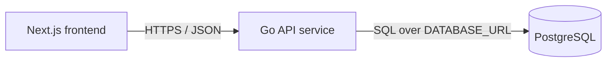

# Service & Interface Design — Todo List App v2

Last updated: 2026-08-11
Source: `docs/todos/SRS.md`, `docs/architecture/erd.md`, `docs/architecture/overview.md`

## 1. Service map



| Service | Responsibility | Owns (tables) | Depends on | Deploy unit |
|---|---|---|---|---|
| Next.js frontend | Renders the single-page todo UI, validates obvious client-side form rules for immediate feedback, and calls the API for durable state. | none | Go API service via `NEXT_PUBLIC_API_URL` | frontend container |
| Go API service | Owns todo persistence, validates all external API input, applies migrations, exposes health and todo JSON endpoints. | `todos` | PostgreSQL via `DATABASE_URL` | backend container |
| PostgreSQL | Durable storage for the deployment-level shared todo list. | n/a | none | database service |

**Why these boundaries** — single backend service: no additional boundary is justified yet because there is one data aggregate, one owner, one deploy cadence, and no independently scaling or third-party integration concern. The frontend/backend boundary is justified by deploy/runtime difference: browser-rendered UI consumes HTTPS JSON while the Go service owns persistence and database access.

**Entity ownership**

| ERD entity | Owning service | Write access | Read access |
|---|---|---|---|
| `todos` | Go API service | Go API service only through parameterized SQL | Frontend reads only through Go API endpoints; no direct database access |

## 2. Cross-cutting contract

### 2.1 Base

- Base URL: `{scheme}://{host}/api/v1`
- Content type: `application/json; charset=utf-8`
- Versioning: URL path major version. A new major version is used only for breaking changes.
- Trace header: `X-Request-Id` accepted from the caller, generated if absent, echoed on every response and present in every backend log line.
- Response timestamps: RFC 3339 UTC strings.
- IDs: UUID strings on the wire.
- Collection response shape: objects with a `todos` array and pagination metadata when applicable; no bare arrays.

### 2.2 Authentication and authorization

| Aspect | Decision |
|---|---|
| Mechanism | None. The product has no login; all visitors use the shared deployment-level list. |
| Token lifetime | n/a |
| Refresh | n/a |
| Transport | No `Authorization` header required or interpreted for todo endpoints. |
| Roles | Single anonymous `User` actor. |
| Enforcement point | API route layer permits anonymous access; no per-resource ownership checks exist because there is no identity. |

### 2.3 Error contract

Every non-2xx response, from every endpoint, has this shape:

```json
{
  "error": {
    "code": "VALIDATION_FAILED",
    "message": "Human-readable summary, safe to show a user.",
    "details": [
      { "field": "title", "code": "TOO_LONG", "message": "Title must be 200 characters or fewer." }
    ],
    "request_id": "01HXEXAMPLE"
  }
}
```

Consumers branch on `code`. `message` and detail `message` are display text and may be reworded at any time without notice; they are not part of the contract. `details` is always present and is an empty array when there is no field-specific detail.

**Error catalog** — the full closed set for this project.

| Code | HTTP | Meaning | Retryable |
|---|---|---|---|
| `BAD_REQUEST` | 400 | Request JSON is malformed, body is too large, or a field has the wrong JSON type. | no |
| `VALIDATION_FAILED` | 422 | Request is well-formed but violates semantic rules such as blank or overlong title. | no |
| `NOT_FOUND` | 404 | Todo does not exist, including already-deleted todos. | no |
| `RATE_LIMITED` | 429 | Too many requests from the same client source; response includes `Retry-After`. | yes |
| `INTERNAL` | 500 | Unexpected failure; details are logged with `request_id`, not returned. | yes |
| `UNAVAILABLE` | 503 | Database is unavailable, migrations are incomplete, or the service is shutting down. | yes |

Authentication errors are deliberately absent because the approved scope has no login, credentials, roles, or private resources.

### 2.4 Pagination

The list is small but can grow and is written concurrently, so the project uses cursor pagination for every collection endpoint. The first UI version may request the default page only; the API still exposes a single stable scheme to avoid later breaking changes.

```
GET /api/v1/todos?limit=50&cursor=eyJjcmVhdGVkX2F0IjoiMjAyNi0wOC0xMVQxMDowNDoxOFoiLCJpZCI6IjAxOTAwMDAwLTAwMDAtNzAwMC04MDAwLTAwMDAwMDAwMDAwMCJ9
```

```json
{
  "todos": [
    {
      "id": "01900000-0000-7000-8000-000000000000",
      "title": "Buy milk",
      "is_completed": false,
      "created_at": "2026-08-11T10:04:18Z",
      "updated_at": "2026-08-11T10:04:18Z"
    }
  ],
  "next_cursor": null,
  "has_more": false
}
```

| Aspect | Decision |
|---|---|
| Style | Cursor. Cursor encodes `created_at` and `id` from the last item in URL-safe base64 JSON. |
| Default limit | 100, matching the SRS boundary that 100 todos must render. |
| Max limit | 100. Higher values return `VALIDATION_FAILED`. |
| Default sort | `created_at ASC, id ASC`, stable and unique. |

### 2.5 Validation boundary

The validation boundary is the Go API HTTP handler layer, before any repository/database call. It validates method, content type, body size, JSON syntax, field presence, field type, UUID path format, string trimming, title length, boolean type, query limit range, and cursor format. Downstream service and repository code may trust validated inputs and must not perform defensive re-validation except for database constraint handling as a final integrity guard.

### 2.6 Idempotency

| Endpoint | Accepts `Idempotency-Key` | Retention | Replay behavior |
|---|---|---|---|
| `POST /api/v1/todos` | No for v1. Creating duplicate titles is allowed and retries can intentionally create another todo. | n/a | n/a |
| `PATCH /api/v1/todos/{todo_id}` | No. Last successful write wins; setting `is_completed` to the same value is safe and returns the current todo. | n/a | n/a |
| `DELETE /api/v1/todos/{todo_id}` | No. The HTTP method is idempotent by resource state: deleting an existing todo returns 204; deleting a missing/already-deleted todo returns 404 so the UI can refresh/remove it. | n/a | n/a |

## 3. Endpoints

### 3.1 `GET /api/v1/todos`

**Purpose** — Load persisted non-deleted todos in stable oldest-first order for the single page. **Traces to** — TODOS-001, TODOS-005. **Auth** — anonymous User.

**Path / query parameters**

| Name | In | Type | Required | Constraints | Description |
|---|---|---|---|---|---|
| `limit` | query | integer | no | 1 to 100 inclusive; default 100; reject non-integers | Maximum todos to return. |
| `cursor` | query | string | no | URL-safe base64 encoded JSON containing `created_at` RFC 3339 UTC and `id` UUID from a previous response | Starts the page after the cursor item. |

**Request body**

No request body is allowed. If a body is sent with non-zero length, the API ignores it for GET and does not create side effects.

**Success response** — `200`

```json
{
  "todos": [
    {
      "id": "01900000-0000-7000-8000-000000000000",
      "title": "Buy milk",
      "is_completed": false,
      "created_at": "2026-08-11T10:04:18Z",
      "updated_at": "2026-08-11T10:04:18Z"
    }
  ],
  "next_cursor": null,
  "has_more": false
}
```

| Field | Type | Nullable | Description |
|---|---|---|---|
| `todos` | array of todo objects | no | Current page of todos. Empty array means no matching todos. |
| `todos[].id` | string UUID | no | Stable todo identifier. |
| `todos[].title` | string | no | Trimmed todo title, 1 to 200 characters. |
| `todos[].is_completed` | boolean | no | `false` for active, `true` for completed. |
| `todos[].created_at` | string timestamp | no | Creation time, RFC 3339 UTC. |
| `todos[].updated_at` | string timestamp | no | Last successful update time, RFC 3339 UTC. |
| `next_cursor` | string | yes | Cursor for the next page; `null` when `has_more` is false. |
| `has_more` | boolean | no | Whether another page exists. |

**Errors** — every code this endpoint can return. No others.

| Code | HTTP | Trigger |
|---|---|---|
| `VALIDATION_FAILED` | 422 | `limit` is outside 1..100 or `cursor` is not a valid cursor. |
| `RATE_LIMITED` | 429 | Client source exceeds read rate limit. |
| `INTERNAL` | 500 | Unexpected server error. |
| `UNAVAILABLE` | 503 | Database is unreachable, migrations are not ready, or service is shutting down. |

**Notes** — No side effects. Stable ordering is guaranteed by `created_at ASC, id ASC`. Empty state is represented by `todos: []`, not an error. The frontend shows loading before this response and a retryable non-technical error on retryable failures.

### 3.2 `POST /api/v1/todos`

**Purpose** — Create one active todo durably from user-entered text. **Traces to** — TODOS-002, TODOS-006. **Auth** — anonymous User.

**Path / query parameters**

| Name | In | Type | Required | Constraints | Description |
|---|---|---|---|---|---|
| none | n/a | n/a | n/a | n/a | n/a |

**Request body**

```json
{
  "title": "Buy milk"
}
```

| Field | Type | Required | Constraints | Description |
|---|---|---|---|---|
| `title` | string | yes | Trimmed by the API before validation; 1 to 200 characters after trimming; no coercion from other JSON types | Todo label to save. Duplicate titles are allowed. |

**Success response** — `201`

Headers:

- `Location: /api/v1/todos/{todo_id}`

```json
{
  "id": "01900000-0000-7000-8000-000000000000",
  "title": "Buy milk",
  "is_completed": false,
  "created_at": "2026-08-11T10:04:18Z",
  "updated_at": "2026-08-11T10:04:18Z"
}
```

| Field | Type | Nullable | Description |
|---|---|---|---|
| `id` | string UUID | no | Stable todo identifier generated by the database. |
| `title` | string | no | Trimmed saved title. |
| `is_completed` | boolean | no | Always `false` on create. |
| `created_at` | string timestamp | no | Creation time, RFC 3339 UTC. |
| `updated_at` | string timestamp | no | Initial update time, equal to `created_at` at creation. |

**Errors** — every code this endpoint can return. No others.

| Code | HTTP | Trigger |
|---|---|---|
| `BAD_REQUEST` | 400 | Malformed JSON, body over payload cap, missing JSON object, wrong field type, or unsupported content type. |
| `VALIDATION_FAILED` | 422 | Trimmed `title` is blank or longer than 200 characters. |
| `RATE_LIMITED` | 429 | Client source exceeds write rate limit. |
| `INTERNAL` | 500 | Unexpected server error. |
| `UNAVAILABLE` | 503 | Database is unreachable, migrations are not ready, or service is shutting down. |

**Notes** — The API trims the title before validation and storage. On any error, no durable todo is implied; the frontend must preserve the user's current input text. No `Idempotency-Key` is accepted in v1.

### 3.3 `PATCH /api/v1/todos/{todo_id}`

**Purpose** — Mark one todo complete or incomplete and return the saved state. **Traces to** — TODOS-003, TODOS-006. **Auth** — anonymous User.

**Path / query parameters**

| Name | In | Type | Required | Constraints | Description |
|---|---|---|---|---|---|
| `todo_id` | path | string UUID | yes | Valid UUID string | Todo to update. |

**Request body**

```json
{
  "is_completed": true
}
```

| Field | Type | Required | Constraints | Description |
|---|---|---|---|---|
| `is_completed` | boolean | yes | Must be JSON boolean; no coercion from string or number | New completion status. `true` means completed, `false` means active. |

`PATCH` uses absent vs null as follows: absent fields are unchanged, but for v1 `is_completed` is required so a request with no changeable field returns `BAD_REQUEST`; `null` is invalid because completion state cannot be cleared.

**Success response** — `200`

```json
{
  "id": "01900000-0000-7000-8000-000000000000",
  "title": "Buy milk",
  "is_completed": true,
  "created_at": "2026-08-11T10:04:18Z",
  "updated_at": "2026-08-11T10:05:30Z"
}
```

| Field | Type | Nullable | Description |
|---|---|---|---|
| `id` | string UUID | no | Stable todo identifier. |
| `title` | string | no | Trimmed saved title. |
| `is_completed` | boolean | no | Saved completion status after the update. |
| `created_at` | string timestamp | no | Original creation time, unchanged by status update. |
| `updated_at` | string timestamp | no | Time of this successful update, RFC 3339 UTC. |

**Errors** — every code this endpoint can return. No others.

| Code | HTTP | Trigger |
|---|---|---|
| `BAD_REQUEST` | 400 | Malformed JSON, body over payload cap, missing JSON object, wrong field type, missing `is_completed`, `is_completed: null`, unsupported content type, or invalid `todo_id` UUID format. |
| `NOT_FOUND` | 404 | No todo exists with `todo_id`, including a todo deleted by another visitor. |
| `RATE_LIMITED` | 429 | Client source exceeds write rate limit. |
| `INTERNAL` | 500 | Unexpected server error. |
| `UNAVAILABLE` | 503 | Database is unreachable, migrations are not ready, or service is shutting down. |

**Notes** — Last successful write wins. Updating to the already-saved status still returns `200` with the current todo and a refreshed `updated_at` only if a write is executed; implementation may skip the write and preserve `updated_at` when the value is unchanged, but the response must be the saved row. On `NOT_FOUND`, the frontend should remove the missing todo or refresh the list and show a non-technical message.

### 3.4 `DELETE /api/v1/todos/{todo_id}`

**Purpose** — Hard-delete one todo so it no longer appears after refresh. **Traces to** — TODOS-004, TODOS-006. **Auth** — anonymous User.

**Path / query parameters**

| Name | In | Type | Required | Constraints | Description |
|---|---|---|---|---|---|
| `todo_id` | path | string UUID | yes | Valid UUID string | Todo to delete. |

**Request body**

No request body is allowed. If a body is sent with non-zero length, return `BAD_REQUEST`.

**Success response** — `204`

No response body.

| Field | Type | Nullable | Description |
|---|---|---|---|
| n/a | n/a | n/a | No body on success. |

**Errors** — every code this endpoint can return. No others.

| Code | HTTP | Trigger |
|---|---|---|
| `BAD_REQUEST` | 400 | Invalid `todo_id` UUID format or non-empty request body. |
| `NOT_FOUND` | 404 | No todo exists with `todo_id`, including a todo already deleted by another visitor. |
| `RATE_LIMITED` | 429 | Client source exceeds write rate limit. |
| `INTERNAL` | 500 | Unexpected server error. |
| `UNAVAILABLE` | 503 | Database is unreachable, migrations are not ready, or service is shutting down. |

**Notes** — Deletion is hard delete with no undo, matching the ERD lifecycle and approved scope. On save failure, the frontend must keep or restore the todo in the visible list. On `NOT_FOUND`, the frontend should remove the missing todo or refresh the list and show a non-technical message.

### 3.5 `GET /healthz`

**Purpose** — Runtime health check for container orchestration and local readiness. **Traces to** — architecture startup/readiness convention. **Auth** — none.

**Path / query parameters**

| Name | In | Type | Required | Constraints | Description |
|---|---|---|---|---|---|
| none | n/a | n/a | n/a | n/a | n/a |

**Request body**

No request body is used.

**Success response** — `200`

```json
{
  "status": "ok"
}
```

| Field | Type | Nullable | Description |
|---|---|---|---|
| `status` | string enum | no | Always `ok` when migrations have succeeded and database `SELECT 1` succeeds. |

**Errors** — every code this endpoint can return. No others.

| Code | HTTP | Trigger |
|---|---|---|
| `UNAVAILABLE` | 503 | Database check fails, migrations have not completed, or service is shutting down. |
| `INTERNAL` | 500 | Unexpected health handler failure. |

**Notes** — This endpoint is outside `/api/v1` for conventional health probing. It has no side effects and should use a short database check timeout.

## 4. Asynchronous work

No jobs, queues, schedules, or events are part of the approved scope.

| Name | Trigger | Payload | Retry | Backoff | Dead letter | Idempotent |
|---|---|---|---|---|---|---|
| n/a | n/a | n/a | n/a | n/a | n/a | n/a |

## 5. External integrations and cross-service calls

### 5.1 Runtime calls

| Caller | Callee | Purpose | Mode | Timeout | Retry | Idempotency key | On failure |
|---|---|---|---|---|---|---|---|
| Next.js frontend | Go API service | Load todos | Synchronous HTTPS JSON | 5 seconds | One user-initiated retry through the visible retry control; no automatic background retry loop | n/a for read | Show a non-technical error state and keep page controls usable enough to retry. |
| Next.js frontend | Go API service | Create todo | Synchronous HTTPS JSON | 5 seconds | No automatic retry for `POST`; user may explicitly submit again | none in v1 | Show a non-technical save error and preserve the current input text. |
| Next.js frontend | Go API service | Update completion status | Synchronous HTTPS JSON | 5 seconds | No automatic retry; user may explicitly try again | none in v1 | Revert the visible todo to the last saved status and show a non-technical error. |
| Next.js frontend | Go API service | Delete todo | Synchronous HTTPS JSON | 5 seconds | No automatic retry; user may explicitly try again | n/a; DELETE is resource-state idempotent | Keep or restore the todo in the visible list and show a non-technical error. |
| Go API service | PostgreSQL | Query and mutate todos | Synchronous SQL | 3 seconds per query; 10 seconds startup migration budget | No automatic retry for writes; health/readiness may retry on the next probe | Database transaction/primary key constraints; no HTTP idempotency key | Return `UNAVAILABLE` for dependency failure or `INTERNAL` for unexpected errors; log details with `request_id`. |

### 5.2 Third-party integrations

There are no third-party integrations, callbacks, webhooks, OAuth flows, email providers, payment providers, or external secrets in the approved scope.

| System | Purpose | Protocol | Timeout | Retry | On failure | Secrets |
|---|---|---|---|---|---|---|
| n/a | n/a | n/a | n/a | n/a | n/a | none |

## 6. Non-functional targets

| Aspect | Target |
|---|---|
| p95 latency (read) | `GET /api/v1/todos` returns within 500 ms from the backend under 100 todos, excluding cold start and network latency. |
| p95 latency (write) | Create, update, and delete endpoints return within 500 ms from the backend under normal database conditions, enabling UI feedback within 200 ms optimistically and durable confirmation shortly after. |
| Availability | Backend reports healthy only after migrations and database check succeed; unhealthy dependencies return `503 UNAVAILABLE`. |
| Rate limit | Per client source: 120 reads/minute and 60 writes/minute. When exceeded, return `RATE_LIMITED` with `Retry-After`. |
| Payload cap | 16 KiB request body for todo write endpoints. |
| Timeout (inbound) | 10 seconds total request handling timeout; database operations within handlers capped at 3 seconds. |

## 7. Observability

- Log fields present on every request line: `request_id`, timestamp, method, path template, status, duration_ms, response_bytes, client_source_hash, and error code when present.
- Metrics per endpoint: request count, error count by error code/status, p50/p95/p99 duration, and in-flight requests.
- Database metrics: migration success/failure, query duration by operation, connection acquisition failures.
- What is never logged: secrets, tokens, raw `DATABASE_URL`, full request bodies, full todo titles, stack traces in user responses, or private deployment credentials. Todo title validation logs may include length but not content.

## 8. Contract evolution

| Change | Additive or breaking | Migration path |
|---|---|---|
| Add a new optional response field to todo objects | Additive | Frontend must ignore unknown response fields. |
| Add a new optional query parameter to `GET /api/v1/todos` | Additive if default behavior remains unchanged | Document parameter; existing clients continue without it. |
| Add a new endpoint under `/api/v1` | Additive | No migration needed for existing clients. |
| Add a required request field to an existing endpoint | Breaking | Create `/api/v2` endpoint or make the field optional first, migrate frontend, then deprecate v1. |
| Rename, remove, or change type of any existing response field | Breaking | Add new field first, migrate frontend, announce deprecation, remove only in a future major version. |
| Change list default ordering or default limit | Breaking | Add optional sort/limit parameter first; migrate frontend; change default only in `/api/v2`. |
| Change an error code or HTTP status for an existing condition | Breaking | Introduce a new endpoint/version or dual-handle in frontend before removal. |

## 9. Requirement traceability

| SRS requirement | Endpoint coverage |
|---|---|
| TODOS-001 — View todo page | `GET /api/v1/todos` supplies list/empty/error data for the single page; frontend UI details are covered by design and SRS. |
| TODOS-002 — Add todo | `POST /api/v1/todos` validates, trims, saves, and returns created active todo. |
| TODOS-003 — Complete and uncomplete todo | `PATCH /api/v1/todos/{todo_id}` persists `is_completed` true/false and returns saved state. |
| TODOS-004 — Delete todo | `DELETE /api/v1/todos/{todo_id}` hard-deletes a todo and returns no content. |
| TODOS-005 — Load persisted todos | `GET /api/v1/todos` loads saved todos ordered by `created_at ASC, id ASC`. |
| TODOS-006 — Save todo changes durably | `POST /api/v1/todos`, `PATCH /api/v1/todos/{todo_id}`, and `DELETE /api/v1/todos/{todo_id}` persist create/status/delete changes and define failure behavior. |

| Endpoint | Requirement source |
|---|---|
| `GET /api/v1/todos` | TODOS-001, TODOS-005 |
| `POST /api/v1/todos` | TODOS-002, TODOS-006 |
| `PATCH /api/v1/todos/{todo_id}` | TODOS-003, TODOS-006 |
| `DELETE /api/v1/todos/{todo_id}` | TODOS-004, TODOS-006 |
| `GET /healthz` | Architecture overview startup/readiness convention, not a product SRS endpoint |

## 10. Open questions

| Question | Owner | Blocking |
|---|---|---|
| none | n/a | no |
